  

<table>
<tr>
<td width="170" valign="top">
  
</td>
<td valign="top">
  <h3>Aldir Pedro</h3>
  

    Software developer working across <strong>Python</strong>, <strong>Java</strong>,
    <strong>JavaScript/TypeScript</strong>, <strong>C/C++</strong> and <strong>C#</strong>.
    Multitasker by nature — comfortable moving between different parts of a project.
    A businessman navigating the tech world.
  

</td>
</tr>
</table>

 

### Stack

 

### Currently building

**[DTCenter_app](https://github.com/aldirpedro/DTCenter_app)** — a data center simulator app;
architecture and planning docs in progress.

 

### Featured projects

<table>
<tr>
<td width="33%" valign="top">
  <strong><a href="https://github.com/aldirpedro/aldijos">aldijos</a></strong>
  
Asynchronous activity platform for schools — student, teacher and admin panels,
  authentication, grading and submissions.

  <code>JavaScript</code>
</td>
<td width="33%" valign="top">
  <strong><a href="https://github.com/aldirpedro/blogue_noticia">blogue_noticia</a></strong>
  
News blog built with Next.js and Tailwind CSS.

  <code>TypeScript</code>
</td>
<td width="33%" valign="top">
  <strong><a href="https://github.com/aldirpedro/Baserow">Baserow</a></strong>
  
REST API for library management.

  <code>Python</code>
</td>
</tr>
</table>

 

### GitHub

 

### Contact

[Instagram](https://www.instagram.com/aldir_pedro)
